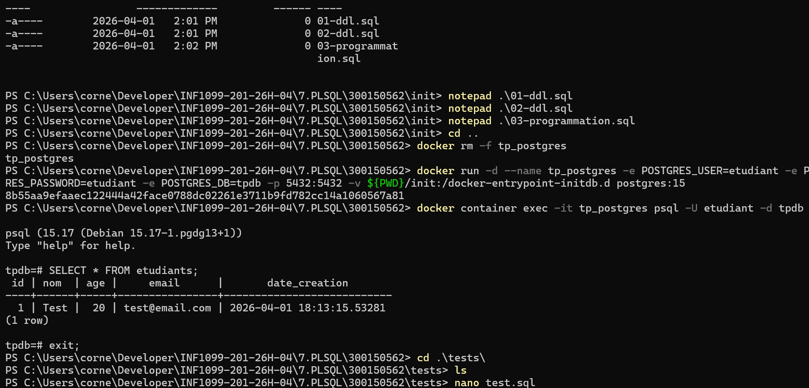

# 🐘 TP PostgreSQL — PL/pgSQL (Fonctions, Procédures, Triggers)

## 📚 Description
Ce projet implémente des fonctionnalités avancées de **PL/pgSQL** dans PostgreSQL : procédures stockées, fonctions, triggers et gestion des erreurs.  
L’objectif est de manipuler la logique métier directement dans la base de données.

---

## 🧱 Structure

```
300150562/
├── init/
│ ├── 01-ddl.sql
│ ├── 02-dml.sql
│ └── 03-programmation.sql
├── tests/
│ └── test.sql
└── README.md
```

---

## ⚙️ Technologies
- PostgreSQL 15  
- Docker  
- PL/pgSQL  

---

## 🚀 Lancement

### ▶️ Démarrer PostgreSQL
```bash
docker run -d --name tp_postgres -e POSTGRES_USER=etudiant -e POSTGRES_PASSWORD=etudiant -e POSTGRES_DB=tpdb -p 5432:5432 -v ${PWD}/init:/docker-entrypoint-initdb.d postgres:15
```

🗄️ Base de données
etudiants → informations étudiants
cours → liste des cours
inscriptions → relation étudiants ↔ cours
logs → historique des actions
🧠 Fonctionnalités
🔹 Procédure ajouter_etudiant
Vérifie âge ≥ 18
Vérifie email valide
Ajoute étudiant + log
Gestion des erreurs
🔹 Fonction nombre_etudiants_par_age
Retourne le nombre d’étudiants dans un intervalle
🔹 Procédure inscrire_etudiant_cours
Vérifie existence étudiant/cours
Vérifie doublon
Inscrit + log
🔹 Triggers
Validation automatique avant insertion
Logging automatique des actions
Tests

```
-- Ajouter étudiant
CALL ajouter_etudiant('Ali', 22, 'ali@email.com');

-- Test erreur
CALL ajouter_etudiant('Bob', 15, 'bob@email.com');

-- Compter
SELECT nombre_etudiants_par_age(18, 30);

-- Inscription
CALL inscrire_etudiant_cours('ali@email.com', 'Math');

-- Logs
SELECT * FROM logs;


```



