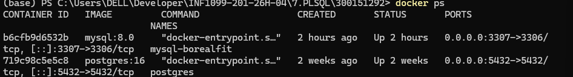
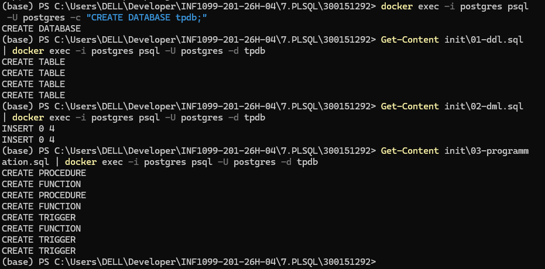
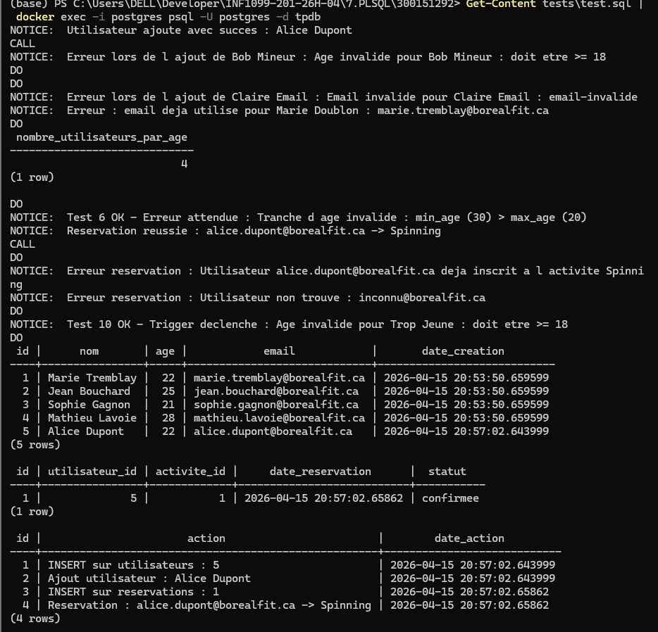
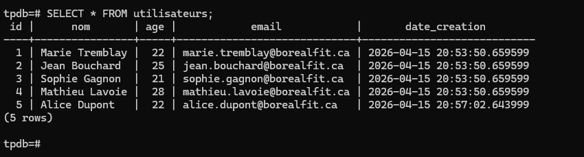
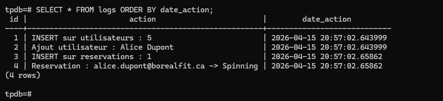

# 🏋️ TP PostgreSQL — Stored Procedures
## BorealFit — Fonctions, Procédures Stockées et Triggers

  

**Auteur : Amine Kahil**  |  **No. étudiant : 300151292**  |  **Domaine : BorealFit**

---

## 📋 Table des matières

- [🎯 Objectifs](#-objectifs)
- [📁 Structure du projet](#-structure-du-projet)
- [🗂️ Définitions clés](#-définitions-clés)
- [🐳 Démarrer avec Docker](#-démarrer-avec-docker)
- [📝 Fichiers SQL](#-fichiers-sql)
- [✅ Exécuter les tests](#-exécuter-les-tests)
- [🖼️ Captures d'écran](#-captures-décran)
- [🔍 Vérification finale](#-vérification-finale)

---

## 🎯 Objectifs

| # | Objectif | Statut |
|---|----------|--------|
| 1 | Expliquer la différence entre fonction et procédure stockée | ✅ |
| 2 | Créer et appeler des fonctions et procédures en PL/pgSQL | ✅ |
| 3 | Utiliser les triggers pour automatiser la logique métier | ✅ |
| 4 | Gérer les exceptions et le logging dans PostgreSQL | ✅ |

---

## 📁 Structure du projet

```
300151292/
│
├── init/
│   ├── 01-ddl.sql             ← Création des tables
│   ├── 02-dml.sql             ← Données initiales
│   └── 03-programmation.sql   ← Fonctions, procédures, triggers
│
├── tests/
│   └── test.sql               ← Fichier de tests complets
│
├── images/                    ← Captures d'écran
├── 300151292-db.txt           ← Fichier de participation
└── README.md
```

---

## 🗂️ Définitions clés

| Élément | Description | Exemple d'appel |
|---------|-------------|-----------------|
| `FUNCTION` | Retourne une valeur, utilisable dans un `SELECT` | `SELECT nombre_utilisateurs_par_age(18, 25);` |
| `PROCEDURE` | Ne retourne pas de valeur, gère les transactions | `CALL ajouter_utilisateur('Alice', 22, 'alice@borealfit.ca');` |
| `TRIGGER` | Exécuté automatiquement sur `INSERT`, `UPDATE`, `DELETE` | Automatique |

---

## 🐳 Démarrer avec Docker

**Vérifier que le conteneur postgres est actif**
```powershell
docker ps
```

✅ Conteneur `postgres` actif sur le port 5432



**Créer la base de données et charger les fichiers**
```powershell
docker exec -i postgres psql -U postgres -c "CREATE DATABASE tpdb;"
Get-Content init\01-ddl.sql | docker exec -i postgres psql -U postgres -d tpdb
Get-Content init\02-dml.sql | docker exec -i postgres psql -U postgres -d tpdb
Get-Content init\03-programmation.sql | docker exec -i postgres psql -U postgres -d tpdb
```

✅ Tables créées, données insérées, procédures et triggers chargés



---

## 📝 Fichiers SQL

### 🏗️ 01-ddl.sql — Structure des tables

| Table | Description |
|-------|-------------|
| `utilisateurs` | Membres avec nom, âge, email |
| `activites` | Activités sportives disponibles |
| `reservations` | Lien utilisateur ↔ activité |
| `logs` | Journal automatique de toutes les opérations |

### 📥 02-dml.sql — Données initiales

- 4 utilisateurs de test
- 4 activités disponibles

### ⚙️ 03-programmation.sql — PL/pgSQL

**1️⃣ Procédure `ajouter_utilisateur`**
```sql
CALL ajouter_utilisateur('Alice Dupont', 22, 'alice.dupont@borealfit.ca');
```
Validations : âge ≥ 18 · format email valide · email unique · journalisation dans `logs`

**2️⃣ Fonction `nombre_utilisateurs_par_age`**
```sql
SELECT nombre_utilisateurs_par_age(18, 25);
```
Retourne le nombre d'utilisateurs dans une tranche d'âge · valide que `min_age <= max_age`

**3️⃣ Procédure `reserver_activite`**
```sql
CALL reserver_activite('alice.dupont@borealfit.ca', 'Spinning');
```
Validations : utilisateur existe · activité existe · pas de doublon · journalisation dans `logs`

**4️⃣ Trigger `trg_valider_utilisateur`**
- Déclenché `BEFORE INSERT` sur `utilisateurs`
- Valide âge et format email automatiquement
- Bloque l'insertion si invalide

**5️⃣ Triggers `trg_log_utilisateur` et `trg_log_reservation`**
- Déclenchés `AFTER INSERT / UPDATE / DELETE`
- Journalisent chaque opération
- Permettent un historique complet des modifications

---

## ✅ Exécuter les tests

```powershell
Get-Content tests\test.sql | docker exec -i postgres psql -U postgres -d tpdb
```

**Tests couverts :**

| # | Test | Résultat attendu |
|---|------|-----------------|
| 1 | Insertion valide | ✅ Utilisateur ajouté |
| 2 | Âge invalide (< 18) | ✅ Exception capturée |
| 3 | Email mal formé | ✅ Exception capturée |
| 4 | Email doublon | ✅ Erreur unique_violation |
| 5 | Fonction tranche d'âge valide | ✅ Nombre retourné |
| 6 | Tranche d'âge invalide (min > max) | ✅ Exception capturée |
| 7 | Réservation valide | ✅ Réservation créée |
| 8 | Réservation doublon | ✅ Exception capturée |
| 9 | Utilisateur inexistant | ✅ Exception capturée |
| 10 | Trigger INSERT direct invalide | ✅ Trigger déclenché |

✅ Résultats des 10 tests



---

## 🔍 Vérification finale

```powershell
docker exec -it postgres psql -U postgres -d tpdb
```

```sql
SELECT * FROM utilisateurs;
SELECT * FROM reservations;
SELECT * FROM logs ORDER BY date_action;
```

**SELECT * FROM utilisateurs — 5 utilisateurs dont Alice Dupont ajoutée par la procédure**



**SELECT * FROM logs — journalisation automatique de toutes les opérations**



---

## 🎯 Conclusion

Ce laboratoire démontre l'utilisation des langages procéduraux PL/pgSQL dans PostgreSQL. Les fonctions, procédures stockées et triggers permettent de centraliser la logique métier directement dans la base de données, avec une gestion complète des exceptions et une journalisation automatique dans la table `logs`.

---

*TP PostgreSQL — PL/pgSQL · Amine Kahil · 300151292*
