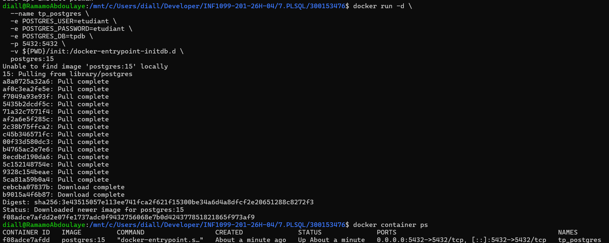
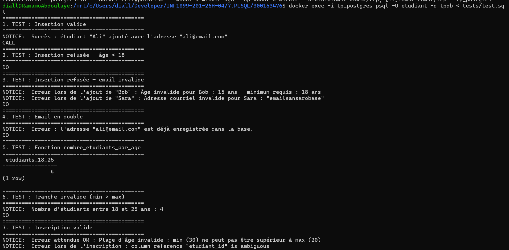

# 🐘 TP PL/pgSQL — Procédures Stockées, Fonctions et Triggers

> **Étudiant :** Ramatoulaye Diallo — `300153476`
> **Cours :** INF1099-201-26H-04
> **Base de données :** PostgreSQL 15 via Docker

---

## 📁 Structure du projet

```
300153476/
│
├── init/
│   ├── 01-ddl.sql            → Création des tables (etudiants, logs)
│   ├── 02-dml.sql            → Données initiales
│   └── 03-programmation.sql  → Procédures, fonctions et triggers
│
├── tests/
│   └── test.sql              → Jeu de tests complet
│
├── images/
│   ├── creation_container.png
│   └── test.png
│
└── README.md
```

---

## 🐳 Lancement du conteneur PostgreSQL

### 🐧 Linux / WSL

```bash
docker run -d \
  --name tp_postgres \
  -e POSTGRES_USER=etudiant \
  -e POSTGRES_PASSWORD=etudiant \
  -e POSTGRES_DB=tpdb \
  -p 5432:5432 \
  -v ${PWD}/init:/docker-entrypoint-initdb.d \
  postgres:15
```

### 🪟 Windows (PowerShell)

```powershell
docker run -d `
  --name tp_postgres `
  -e POSTGRES_USER=etudiant `
  -e POSTGRES_PASSWORD=etudiant `
  -e POSTGRES_DB=tpdb `
  -p 5432:5432 `
  -v ${PWD}/init:/docker-entrypoint-initdb.d `
  postgres:15
```

> 💡 Les fichiers dans `init/` sont exécutés **automatiquement au démarrage** dans l'ordre alphabétique.



---

## ✅ Exécution des tests

### 🐧 Linux / WSL

```bash
docker exec -i tp_postgres psql -U etudiant -d tpdb < tests/test.sql
```

### 🪟 Windows (PowerShell)

```powershell
Get-Content tests/test.sql | docker exec -i tp_postgres psql -U etudiant -d tpdb
```



---

## 🔌 Connexion interactive à la base

```bash
docker exec -it tp_postgres psql -U etudiant -d tpdb
```

---

## 📋 Contenu de `03-programmation.sql`

### 1️⃣ Procédure `ajouter_etudiant`

Ajoute un étudiant avec validations et journalisation automatique.

| Paramètre | Type | Description |
|---|---|---|
| `nom` | TEXT | Nom complet de l'étudiant |
| `age` | INT | Âge — doit être ≥ 18 |
| `email` | TEXT | Courriel valide et unique |

**Validations :**
- ❌ Âge < 18 → exception avec message détaillé
- ❌ Format email invalide → exception
- ❌ Email déjà existant → message `unique_violation`
- ✅ Insertion réussie → `RAISE NOTICE` + entrée dans `logs`

```sql
CALL ajouter_etudiant('Alice', 22, 'alice@email.com');
```

---

### 2️⃣ Fonction `nombre_etudiants_par_age`

Retourne le nombre d'étudiants dans une tranche d'âge donnée.

| Paramètre | Type | Description |
|---|---|---|
| `min_age` | INT | Âge minimum (inclus) |
| `max_age` | INT | Âge maximum (inclus) |

**Retour :** `INT`

**Validation :** si `min_age > max_age` → exception

```sql
SELECT nombre_etudiants_par_age(18, 25);
```

---

### 3️⃣ Trigger `trg_valider_etudiant` — BEFORE INSERT

Bloque automatiquement toute insertion invalide **avant** qu'elle atteigne la table.

- Vérifie l'âge ≥ 18
- Vérifie le format du courriel

> S'exécute automatiquement sur chaque `INSERT` dans `etudiants`.

---

### 4️⃣ Trigger `trg_log_etudiant` — AFTER INSERT / UPDATE / DELETE

Journalise toutes les modifications dans la table `logs` avec le détail de l'opération.

| Opération | Message enregistré |
|---|---|
| `INSERT` | `INSERT sur etudiants — nouveau : [nom]` |
| `UPDATE` | `UPDATE sur etudiants — avant : [ancien] / après : [nouveau]` |
| `DELETE` | `DELETE sur etudiants — supprimé : [nom]` |

---

## 🧪 Résultats des tests

| Test | Résultat |
|---|---|
| Insertion valide (Ali, 22 ans) | ✅ Succès |
| Âge invalide (Bob, 15 ans) | ✅ Erreur attendue |
| Email invalide (Sara) | ✅ Erreur attendue |
| Email en double (ali@email.com) | ✅ Erreur attendue |
| `nombre_etudiants_par_age(18, 25)` | ✅ Retourne 2 |
| Tranche invalide (min 30 > max 20) | ✅ Erreur attendue |
| Table `logs` | ✅ 2 entrées enregistrées |