# 🧪 TP NoSQL — PostgreSQL JSONB avec Docker et Python

> **Objectif :** Construire une mini base NoSQL avec PostgreSQL (JSONB), Docker et Python.

---

## 📁 Structure du projet

```
300150303/
├── README.md
├── images/
├── init.sql
├── app.py
└── requirements.txt
```

---

## 🧱 Partie 1 — Docker : Lancer PostgreSQL

### 1.1 — Commande de lancement

```bash
docker run --name postgres-nosql `
  -e POSTGRES_USER=postgres `
  -e POSTGRES_PASSWORD=postgres `
  -e POSTGRES_DB=ecole `
  -p 5432:5432 `
  -v ${PWD}/init.sql:/docker-entrypoint-initdb.d/init.sql `
  -d postgres
```

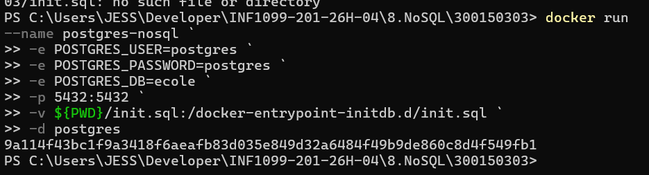

---

### 1.2 — Vérifier que le conteneur tourne

```bash
docker ps
```

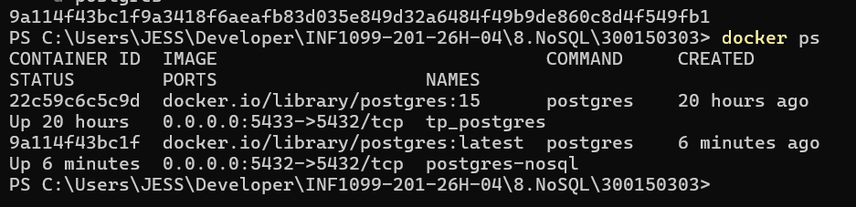

> Le conteneur `postgres-nosql` est visible avec le statut **Up** et le port `0.0.0.0:5432->5432/tcp`.

---

### 1.3 — Connexion à la base `ecole` via psql

```bash
docker exec -it postgres-nosql psql -U postgres -d ecole
```

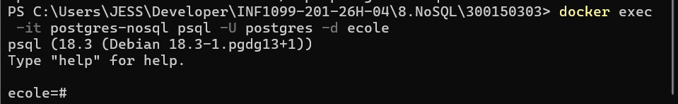

---

### 1.4 — Vérifier le chargement automatique de `init.sql`

```sql
SELECT * FROM etudiants;
```

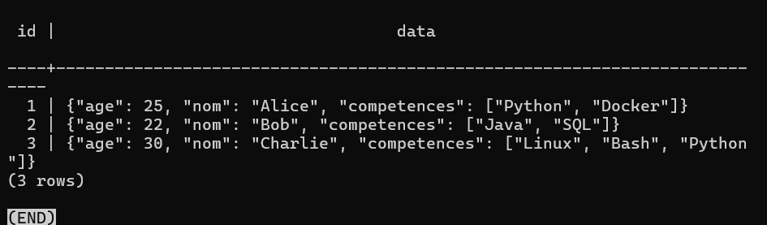

> Les 3 étudiants (Alice, Bob, Charlie) ont été insérés automatiquement au démarrage du conteneur grâce au montage de `init.sql`.

---

## 🟡 Partie 2 — SQL NoSQL : Requêtes JSONB

### 2.1 — Vérifier l'index GIN

```sql
SELECT indexname, indexdef
FROM pg_indexes
WHERE tablename = 'etudiants';
```

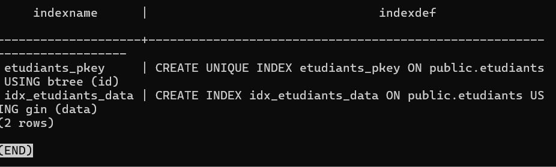

> L'index `idx_etudiants_data` de type **GIN** est bien présent sur la colonne `data`.

---

### 2.2 — Afficher tous les étudiants

```sql
SELECT id, data FROM etudiants;
```

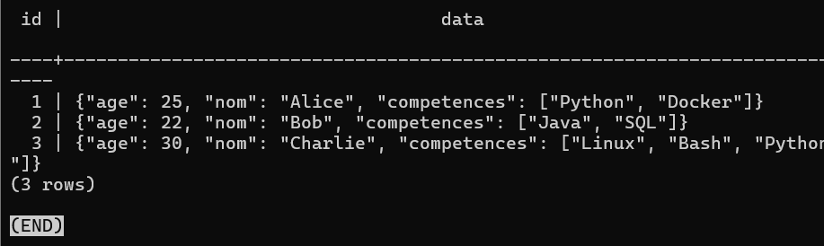

---

### 2.3 — Rechercher par nom — opérateur `->>`

```sql
SELECT data FROM etudiants
WHERE data->>'nom' = 'Alice';
```

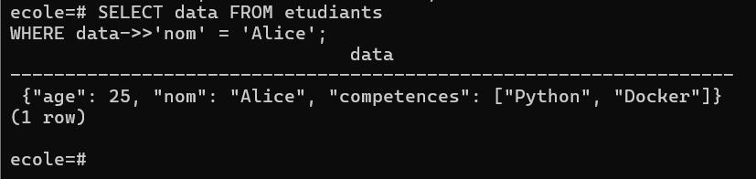

> L'opérateur `->>` retourne la valeur JSON sous forme de **texte** (TEXT), ce qui permet la comparaison avec `= 'Alice'`.

---

### 2.4 — Rechercher par compétence — opérateur `@>`

```sql
SELECT data FROM etudiants
WHERE data->'competences' @> '["Python"]';
```

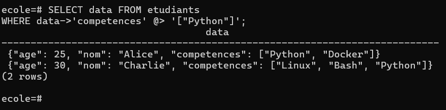

> L'opérateur `@>` vérifie si le tableau JSONB **contient** la valeur recherchée. Résultat : Alice et Charlie ont tous les deux Python.

---

### 2.5 — Démonstration des opérateurs `->` et `->>`

```sql
SELECT
    data->>'nom'  AS nom_texte,
    data->'age'   AS age_json,
    data->>'age'  AS age_texte
FROM etudiants;
```

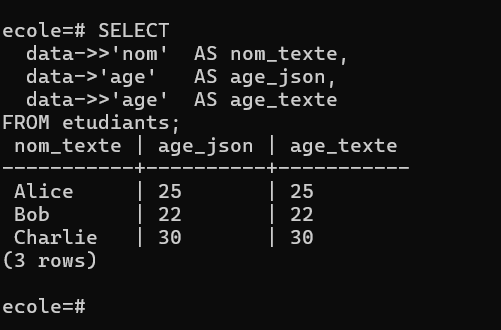

| Opérateur | Retourne | Type |
|-----------|----------|------|
| `->` | Valeur brute JSONB | `jsonb` |
| `->>` | Valeur convertie en texte | `text` |

---

## 🔵 Partie 3 — Python : Script `app.py`

### 3.1 — Installer les dépendances

```bash
pip install -r requirements.txt
```

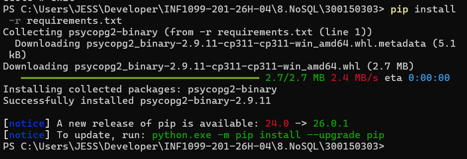

> `psycopg2-binary` version 2.9.11 installé avec succès.

---

### 3.2 — Exécuter le script Python

```bash
python app.py
```

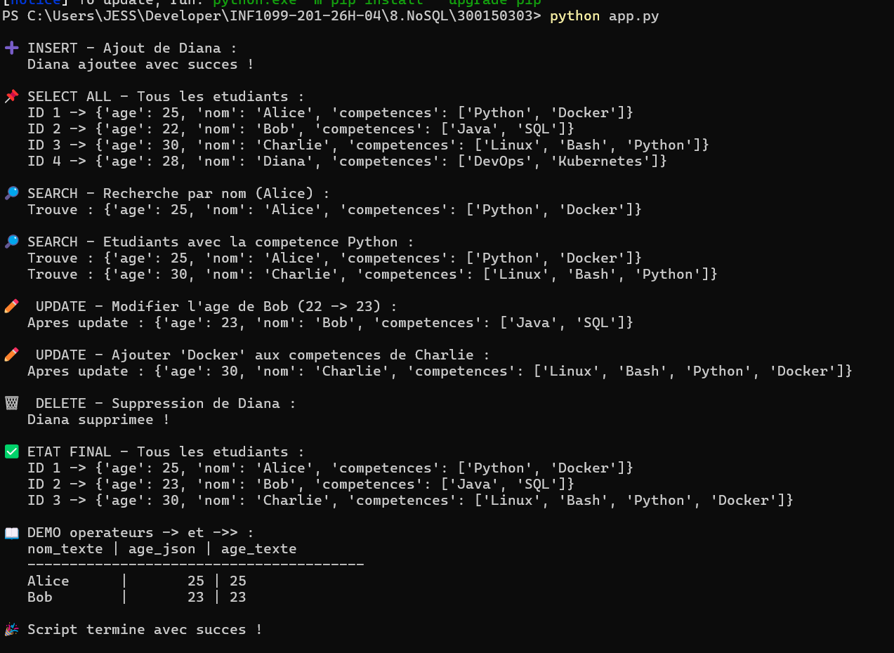

Le script réalise dans l'ordre :

- **INSERT** : ajout de Diana
- **SELECT ALL** : affichage des 4 étudiants
- **SEARCH par nom** : recherche Alice
- **SEARCH par compétence** : Alice et Charlie ont Python
- **UPDATE âge** : Bob passe de 22 à 23
- **UPDATE compétences** : Docker ajouté à Charlie
- **DELETE** : suppression de Diana
- **État final** : 3 étudiants restants
- **Démo opérateurs** : `->` vs `->>`

---

## 🟣 Bonus

### Bonus 1 — UPDATE : Modifier l'âge de Bob

```sql
UPDATE etudiants
SET data = jsonb_set(data, '{age}', '23')
WHERE data->>'nom' = 'Bob';

SELECT data FROM etudiants WHERE data->>'nom' = 'Bob';
```

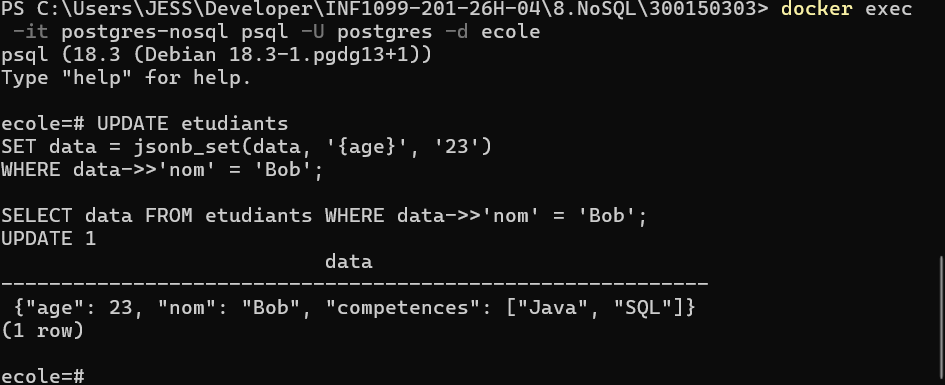

> L'âge de Bob est passé de **22 à 23** grâce à `jsonb_set()`.

---

### Bonus 2 — UPDATE : Ajouter une compétence à Charlie

```sql
UPDATE etudiants
SET data = jsonb_set(
    data,
    '{competences}',
    (data->'competences') || '["Docker"]'
)
WHERE data->>'nom' = 'Charlie';
```

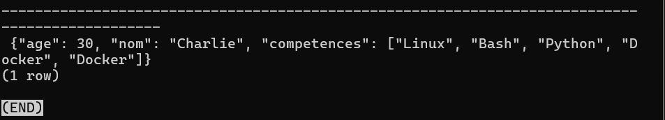

> L'opérateur `||` permet de **concaténer** un élément à un tableau JSONB existant.

---

### Bonus 3 — État final après toutes les opérations

```sql
SELECT id, data FROM etudiants;
```

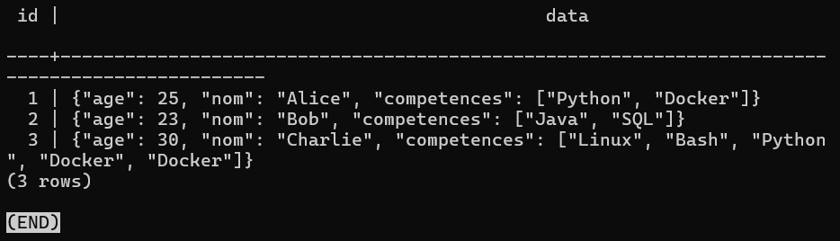

---

## 📝 Récapitulatif des opérateurs JSONB

| Opérateur | Description | Exemple |
|-----------|-------------|---------|
| `->` | Accès par clé → retourne JSONB | `data->'age'` → `25` |
| `->>` | Accès par clé → retourne TEXT | `data->>'nom'` → `"Alice"` |
| `@>` | Contient (tableau/objet) | `data->'competences' @> '["Python"]'` |
| `?` | La clé existe ? | `data ? 'nom'` |
| `jsonb_set()` | Modifier une valeur | `jsonb_set(data, '{age}', '30')` |
| `\|\|` | Concaténer un tableau JSON | `(data->'competences') \|\| '["Docker"]'` |

---

## ✅ Checklist de livraison

- [x] Partie 1 : Docker lancé et base `ecole` fonctionnelle
- [x] Partie 1 : `init.sql` chargé automatiquement (Alice, Bob, Charlie présents)
- [x] Partie 2 : Table `etudiants` avec index GIN
- [x] Partie 2 : Requêtes SELECT ALL, recherche nom, recherche compétence
- [x] Partie 2 : Démonstration `->` vs `->>`
- [x] Partie 3 : `requirements.txt` installé (`psycopg2-binary`)
- [x] Partie 3 : Script Python exécuté (INSERT, SELECT, SEARCH)
- [x] Bonus : UPDATE JSON (âge de Bob)
- [x] Bonus : UPDATE JSON (ajout compétence Charlie)
- [x] Bonus : DELETE étudiant (Diana)
