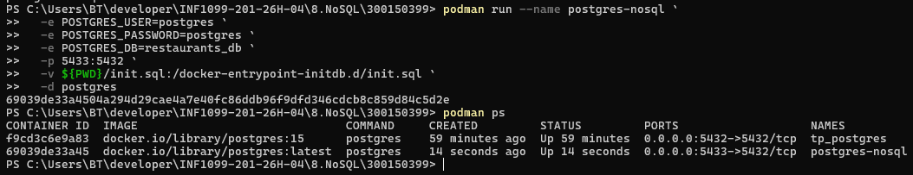
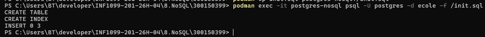
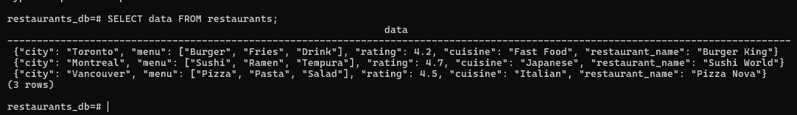
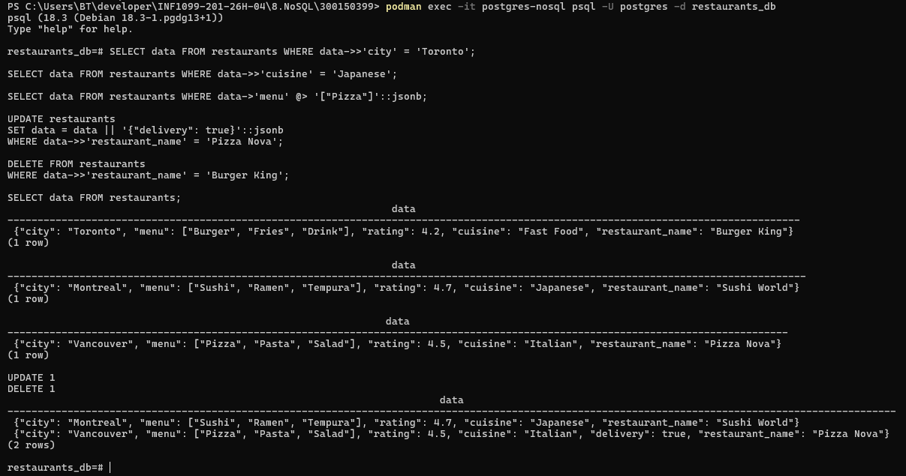
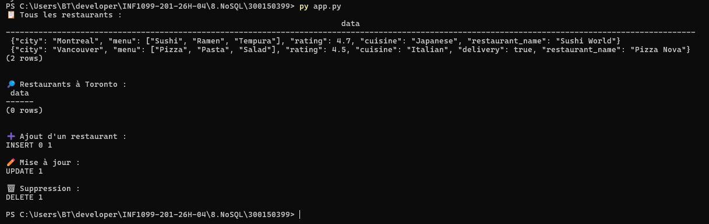

# 🍽️ Système de Gestion de Restaurants — PostgreSQL JSONB

<div align="center">


**Cours :** `INF1099-201-26H-04` &nbsp;|&nbsp; **Étudiant :** Chakib Rahmani &nbsp;|&nbsp; **Matricule :** `300150399`

*Exploration de l'approche NoSQL avec le type JSONB natif de PostgreSQL*

</div>

---

## 📋 Table des matières

1. [Aperçu du projet](#-aperçu-du-projet)
2. [Structure du dépôt](#-structure-du-dépôt)
3. [Environnement technique](#-environnement-technique)
4. [Étapes réalisées](#-étapes-réalisées)
5. [Captures d'écran](#-captures-décran)
6. [Requêtes SQL JSONB](#-requêtes-sql-jsonb)
7. [Opérateurs JSONB](#-opérateurs-jsonb)
8. [Problèmes rencontrés](#-problèmes-rencontrés)
9. [Compétences acquises](#-compétences-acquises)
10. [Résultat final](#-résultat-final)

---

## 🧠 Aperçu du projet

Ce projet implémente un **système de gestion de restaurants** en exploitant la puissance du type `JSONB` de PostgreSQL — une approche hybride qui combine la rigueur du SQL relationnel avec la flexibilité du stockage NoSQL.

Chaque restaurant est représenté sous forme de document JSON contenant :

| Champ | Type | Description |
|---|---|---|
| `restaurant_name` | `string` | Nom du restaurant |
| `city` | `string` | Ville où il est situé |
| `cuisine` | `string` | Type de cuisine proposée |
| `menu` | `array JSON` | Liste des plats avec prix |
| `rating` | `number` | Note sur 5 |
| `delivery` *(optionnel)* | `boolean` | Disponibilité de la livraison |

---

## 📁 Structure du dépôt

```
300150399/
├── images/
│   ├── 1.png          # Conteneur Podman lancé
│   ├── 2.png          # Exécution du script SQL
│   ├── 3.png          # Vérification des données JSON
│   ├── 4.png          # Requêtes JSONB
│   └── 5.png          # Script Python en action
├── init.sql           # Initialisation de la base de données
├── app.py             # Script Python d'automatisation
├── requirements.txt   # Dépendances Python
├── test.sql           # Jeu de requêtes de test
├── test_connect.py    # Vérification de la connexion
└── README.md          # Documentation du projet
```

---

## ⚙️ Environnement technique

<div align="center">

| Composant | Version | Rôle |
|---|---|---|
| Windows | 11 | Système d'exploitation hôte |
| PowerShell | 5.1+ | Terminal de commande |
| Podman | Dernière stable | Gestion du conteneur PostgreSQL |
| PostgreSQL | 16 | Moteur de base de données |
| Python | 3.12 | Automatisation et connexion à la BD |
| psycopg2 | 2.9+ | Pilote PostgreSQL pour Python |

</div>

---

## 🚀 Étapes réalisées

### 1️⃣ — Lancement du conteneur PostgreSQL avec Podman

```powershell
podman run --name pg-restaurants `
  -e POSTGRES_PASSWORD=motdepasse `
  -e POSTGRES_DB=restaurants_db `
  -p 5432:5432 `
  -d postgres:16
```

### 2️⃣ — Initialisation de la base via `init.sql`

```powershell
podman exec -i pg-restaurants psql -U postgres -d restaurants_db `
  -f /chemin/vers/init.sql
```

### 3️⃣ — Création de la table JSONB

```sql
CREATE TABLE restaurants (
    id   SERIAL PRIMARY KEY,
    data JSONB NOT NULL
);
```

### 4️⃣ — Ajout d'un index GIN pour les performances

```sql
CREATE INDEX idx_gin_restaurants ON restaurants USING GIN (data);
```

### 5️⃣ — Insertion de données JSON

```sql
INSERT INTO restaurants (data) VALUES
('{
  "restaurant_name": "Le Petit Bistro",
  "city": "Montréal",
  "cuisine": "Française",
  "menu": [
    {"plat": "Soupe à l''oignon", "prix": 9.50},
    {"plat": "Bœuf bourguignon", "prix": 24.00}
  ],
  "rating": 4.7,
  "delivery": false
}');
```

### 6️⃣ — Requêtes JSONB avancées

Filtrage, recherche dans tableaux, mise à jour partielle, suppression — voir la section [Requêtes SQL JSONB](#-requêtes-sql-jsonb).

### 7️⃣ — Automatisation via Python

Le script `app.py` utilise `psycopg2` pour se connecter à PostgreSQL et exécuter l'ensemble des opérations CRUD de manière programmatique.

### 8️⃣ — Vérification finale

Validation de la cohérence des données et de la connectivité via `test_connect.py` et `test.sql`.

---

## 📸 Captures d'écran

### 1️⃣ Conteneur Podman lancé

<div align="center">



*Démarrage réussi du conteneur PostgreSQL via Podman*

</div>

---

### 2️⃣ Exécution du script SQL

<div align="center">



*Initialisation de la base de données et création de la table JSONB*

</div>

---

### 3️⃣ Vérification des données JSON

<div align="center">



*Consultation des enregistrements JSON insérés dans la table*

</div>

---

### 4️⃣ Requêtes JSONB

<div align="center">



*Exécution des requêtes de filtrage et d'opération sur les champs JSONB*

</div>

---

### 5️⃣ Script Python en action

<div align="center">



*Automatisation des opérations CRUD via le script `app.py`*

</div>

---

## 🧪 Requêtes SQL JSONB

### 🔍 SELECT — Filtrage par ville

```sql
SELECT data->>'restaurant_name' AS nom,
       data->>'city'            AS ville,
       data->>'rating'          AS note
FROM restaurants
WHERE data->>'city' = 'Montréal';
```

---

### 🍜 SELECT — Filtrage par cuisine

```sql
SELECT data->>'restaurant_name' AS nom,
       data->>'cuisine'         AS cuisine
FROM restaurants
WHERE data->>'cuisine' = 'Japonaise';
```

---

### 📦 SELECT — Recherche dans un tableau JSON (`@>`)

```sql
-- Restaurants dont le menu contient un plat spécifique
SELECT data->>'restaurant_name' AS nom
FROM restaurants
WHERE data->'menu' @> '[{"plat": "Sushi"}]';
```

---

### ✏️ UPDATE — Mise à jour partielle d'un champ JSON

```sql
-- Modifier la note d'un restaurant
UPDATE restaurants
SET data = data || '{"rating": 4.9}'
WHERE data->>'restaurant_name' = 'Le Petit Bistro';
```

---

### 🗑️ DELETE — Suppression par critère JSON

```sql
DELETE FROM restaurants
WHERE data->>'city' = 'Québec'
  AND (data->>'rating')::NUMERIC < 3.0;
```

---

## 🔑 Opérateurs JSONB

<div align="center">

| Opérateur | Syntaxe | Retourne | Exemple |
|:---------:|---------|----------|---------|
| `->` | `data->'menu'` | `JSONB` | Retourne le champ `menu` en tant qu'objet JSON |
| `->>` | `data->>'city'` | `TEXT` | Retourne la valeur de `city` en texte brut |
| `@>` | `data @> '{"city":"Montréal"}'` | `BOOLEAN` | Vérifie si le JSON contient une paire clé-valeur |
| `\|\|` | `data \|\| '{"delivery":true}'` | `JSONB` | Fusionne deux objets JSON (mise à jour partielle) |

</div>

> 💡 **Astuce :** Utiliser `->>` pour les comparaisons textuelles dans les clauses `WHERE`, et `->` pour naviguer dans des structures imbriquées.

---

## ⚠️ Problèmes rencontrés

### 🔴 Port 5432 déjà utilisé

**Symptôme :** `Error: address already in use`

**Solution :**
```powershell
# Identifier le processus occupant le port
netstat -ano | findstr :5432
# Terminer le processus ou utiliser un port alternatif
podman run ... -p 5433:5432 ...
```

---

### 🔴 `init.sql` non exécuté automatiquement

**Symptôme :** La table n'existe pas après le démarrage du conteneur.

**Solution :** Avec Podman (contrairement à Docker), le dossier `/docker-entrypoint-initdb.d/` n'est pas toujours monté automatiquement. Il faut exécuter le script manuellement :

```powershell
podman exec -i pg-restaurants psql -U postgres -d restaurants_db < init.sql
```

---

### 🔴 Configuration Python sous Windows

**Symptôme :** `psycopg2` ne s'installe pas / erreur de compilation.

**Solution :** Utiliser la version binaire pré-compilée :

```powershell
pip install psycopg2-binary
```

---

## 🎓 Compétences acquises

```
┌─────────────────────────────────────────────────────────────┐
│                    COMPÉTENCES DÉVELOPPÉES                  │
├──────────────────────────┬──────────────────────────────────┤
│  Base de données         │  JSONB, index GIN, SQL avancé    │
│  Approche NoSQL          │  Documents flexibles dans SQL     │
│  Conteneurisation        │  Podman, isolation d'environnement│
│  Scripting Python        │  psycopg2, automatisation CRUD    │
│  Débogage Windows        │  Ports, chemins, dépendances      │
│  Documentation           │  README professionnel, Markdown   │
└──────────────────────────┴──────────────────────────────────┘
```

---

## 🏁 Résultat final

<div align="center">

| Composant | Statut |
|---|:---:|
| Conteneur PostgreSQL fonctionnel | ✅ |
| Base de données opérationnelle | ✅ |
| Table JSONB créée avec index GIN | ✅ |
| Données JSON insérées | ✅ |
| Requêtes JSONB fonctionnelles | ✅ |
| Script Python `app.py` opérationnel | ✅ |
| Vérification de connexion réussie | ✅ |

</div>

---

<div align="center">

*Projet réalisé dans le cadre du cours **INF1099** — Techniques de l'informatique*
**Chakib Rahmani** · Matricule `300150399`

</div>
