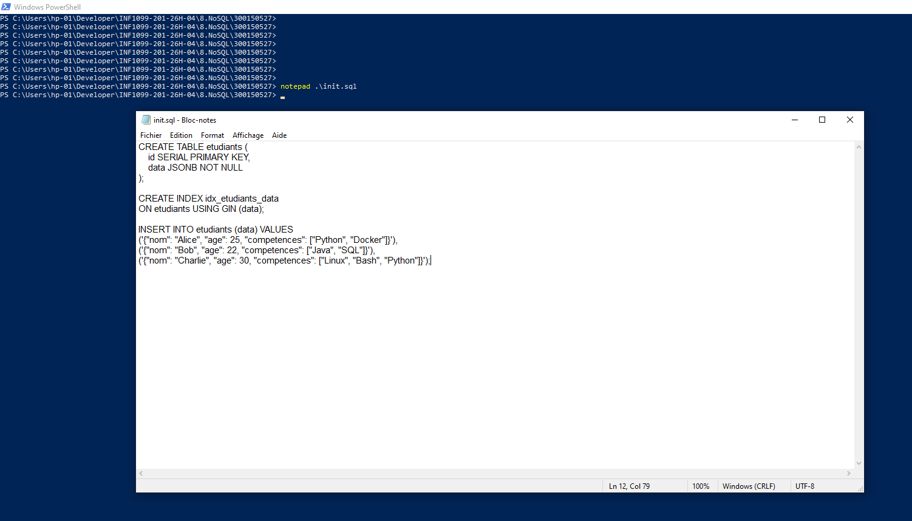
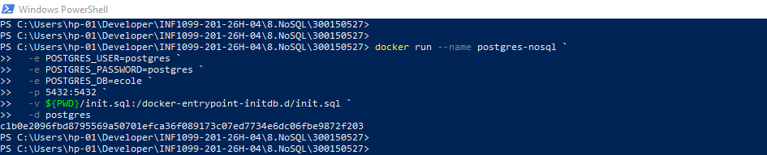
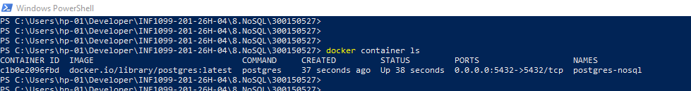
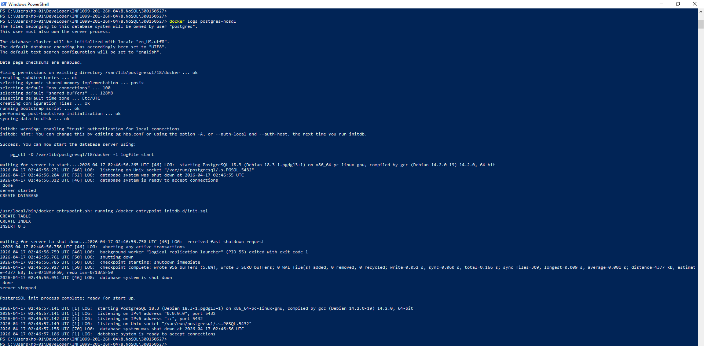
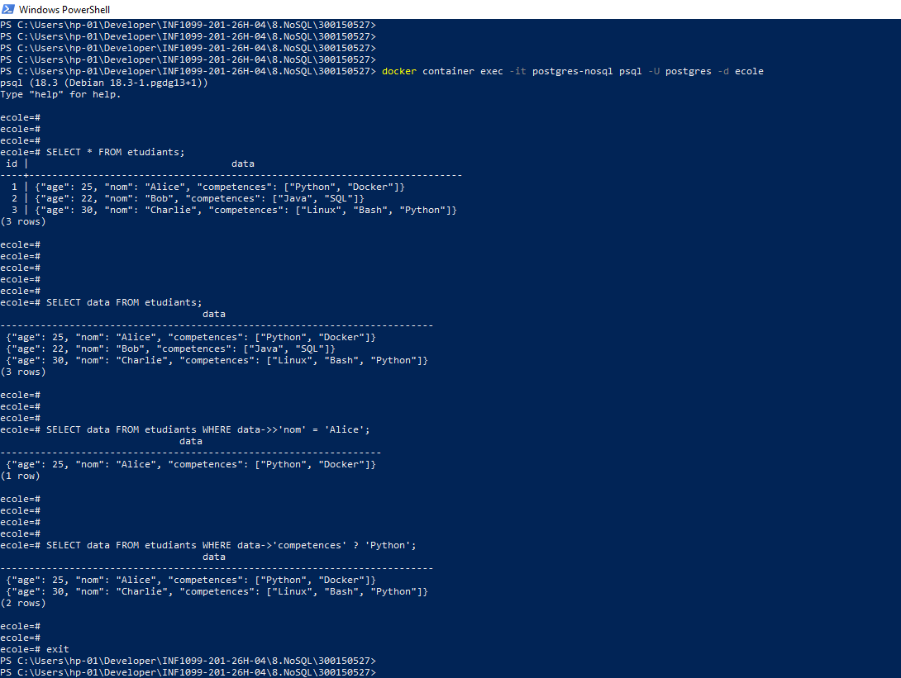
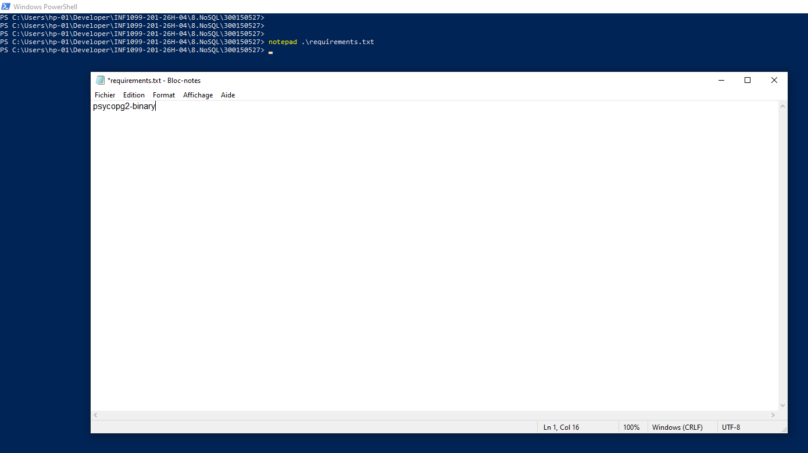
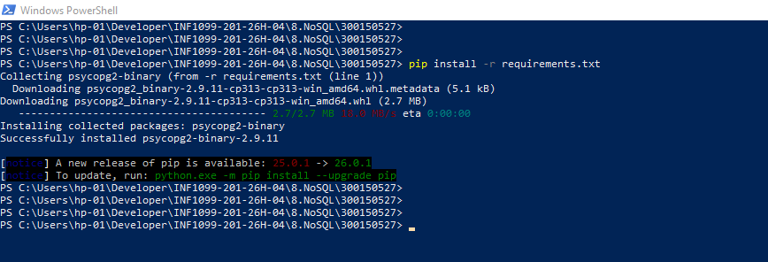
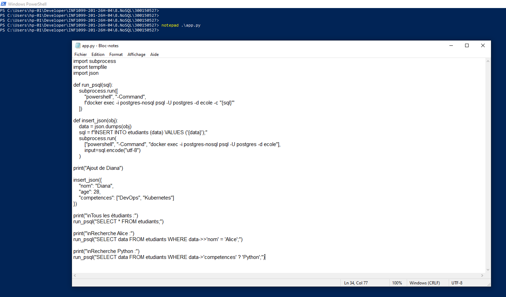
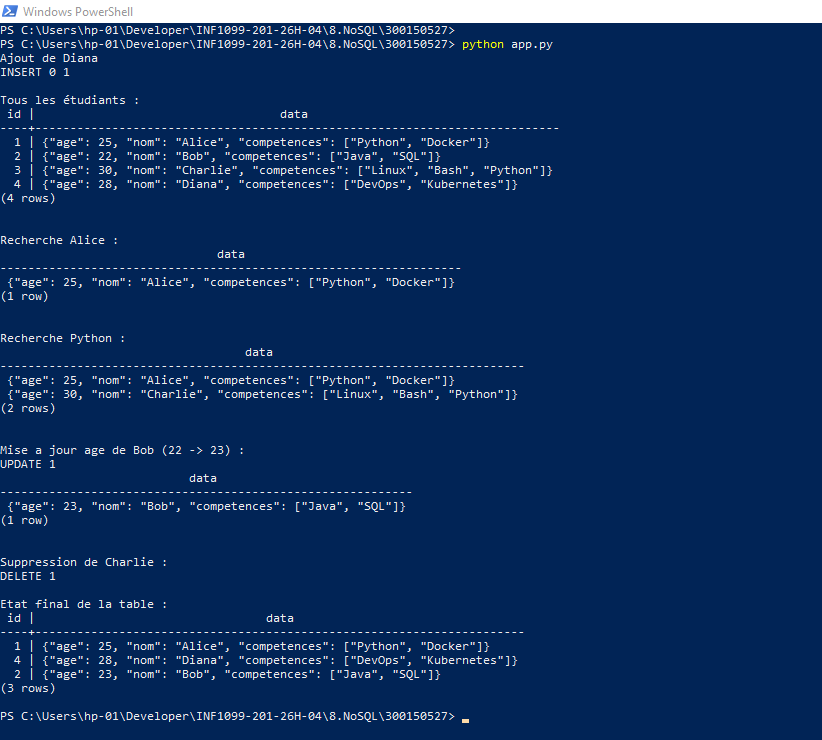

# ⭐ TP NoSQL – PostgreSQL JSONB + Docker + Python

---

## 🎯 Objectif

Construire une mini base de données NoSQL en utilisant :

- 🐘 **PostgreSQL** avec JSONB comme moteur NoSQL
- 🐳 **Docker** pour le déploiement du conteneur
- 🐍 **Python** pour la manipulation des données
- 📦 **requirements.txt** pour la gestion des dépendances

---

## 📁 Structure du projet

```
300150527/
├── README.md
├── init.sql
├── app.py
├── requirements.txt
└── images/
```

---

## 🧱 1) Création de la base — `init.sql`

Le fichier `init.sql` est automatiquement exécuté au démarrage du conteneur. Il crée la table `etudiants` avec un champ `JSONB`, un index GIN pour les recherches, et insère trois enregistrements initiaux.

✔ Table `etudiants` avec colonne `JSONB`  
✔ Index GIN sur les données JSON  
✔ Données initiales (Alice, Bob, Charlie)

📸  


---

## 🐳 2) Lancement de PostgreSQL avec Docker

### 🪟 Windows (PowerShell)

```powershell
docker run --name postgres-nosql `
  -e POSTGRES_USER=postgres `
  -e POSTGRES_PASSWORD=postgres `
  -e POSTGRES_DB=ecole `
  -p 5432:5432 `
  -v ${PWD}/init.sql:/docker-entrypoint-initdb.d/init.sql `
  -d postgres
```

### 🐧 Linux / macOS

```bash
docker run --name postgres-nosql \
  -e POSTGRES_USER=postgres \
  -e POSTGRES_PASSWORD=postgres \
  -e POSTGRES_DB=ecole \
  -p 5432:5432 \
  -v ${PWD}/init.sql:/docker-entrypoint-initdb.d/init.sql \
  -d postgres
```

✔ Conteneur démarré avec succès  
✔ Chargement automatique de `init.sql` au démarrage  
✔ Base `ecole` créée et accessible sur le port 5432

📸 Lancement du conteneur  


📸 Vérification du conteneur actif  


📸 Logs du conteneur  


---

## 🟡 3) Vérification avec psql

Connexion directe à la base depuis le conteneur :

```bash
docker container exec -it postgres-nosql psql -U postgres -d ecole
```

Requêtes exécutées :

| Requête | Description |
|---|---|
| `SELECT * FROM etudiants;` | Afficher tous les enregistrements |
| `SELECT data FROM etudiants WHERE data->>'nom' = 'Alice';` | Recherche par nom |
| `SELECT data FROM etudiants WHERE data->'competences' ? 'Python';` | Recherche par compétence |

✔ Affichage de tous les étudiants  
✔ Recherche par nom avec `->>`  
✔ Recherche par compétence avec `?`

📸  


---

## 📦 4) Dépendances Python — `requirements.txt`

```
psycopg2-binary
```

Installation :

```bash
pip install -r requirements.txt
```

✔ `psycopg2-binary` installé correctement  

📸 `requirements.txt`  


📸 Installation pip  


---

## 💻 5) Script Python — `app.py`

Le script Python se connecte à la base via `psycopg2` et effectue les opérations CRUD suivantes :

✔ **INSERT** — ajout d'un nouvel étudiant (Diana)  
✔ **SELECT ALL** — affichage de tous les étudiants  
✔ **SELECT filtré** — recherche par nom (Alice)  
✔ **SELECT filtré** — recherche par compétence (Python)  
✔ **UPDATE** — mise à jour de l'âge de Bob (22 → 23)  
✔ **DELETE** — suppression de Charlie

📸  


---

## ▶️ 6) Exécution du script

```bash
python app.py
```

Résultats :

- ✅ Ajout de Diana confirmé (`INSERT 0 1`)
- ✅ Affichage des 4 étudiants (Alice, Bob, Charlie, Diana)
- ✅ Recherche Alice — 1 résultat retourné
- ✅ Recherche Python — Alice et Charlie trouvés
- ✅ Mise à jour Bob 22 → 23 (`UPDATE 1`)
- ✅ Suppression Charlie (`DELETE 1`)
- ✅ État final : Alice, Diana, Bob (âge 23)

📸  


---

## 🟣 7) BONUS — Opérations avancées

### UPDATE JSON

Mise à jour d'un champ imbriqué dans un objet JSONB :

```sql
UPDATE etudiants
SET data = jsonb_set(data, '{age}', '23')
WHERE data->>'nom' = 'Bob';
```

### DELETE

Suppression d'un enregistrement par valeur JSON :

```sql
DELETE FROM etudiants
WHERE data->>'nom' = 'Charlie';
```

### Opérateurs JSONB utilisés

| Opérateur | Rôle | Exemple |
|---|---|---|
| `->>` | Extrait une valeur texte | `data->>'nom'` |
| `->` | Extrait un objet/tableau JSON | `data->'competences'` |
| `?` | Vérifie la présence d'une clé ou valeur | `data->'competences' ? 'Python'` |

✔ Bob mis à jour (22 → 23)  
✔ Charlie supprimé  
✔ État final : Alice ✅ | Bob (23) ✅ | Diana ✅ | Charlie ❌

---

## 🧠 Compétences acquises

- 🐳 **Docker** — déploiement et gestion de conteneurs PostgreSQL
- 🐘 **PostgreSQL JSONB** — stockage et requêtes NoSQL dans une base relationnelle
- 🔍 **Requêtes avancées** — utilisation des opérateurs `->`, `->>`, `?` et `jsonb_set`
- 🐍 **Python + psycopg2** — connexion et manipulation de données depuis un script
- 📦 **Gestion des dépendances** — utilisation propre de `requirements.txt`

---

## ✅ Conclusion

Ce TP démontre comment exploiter PostgreSQL comme une base de données NoSQL grâce au type **JSONB**, combiné avec **Docker** pour le déploiement et **Python** pour la manipulation des données. L'approche JSONB offre la flexibilité du NoSQL tout en conservant les avantages d'une base relationnelle (transactions, indexation, requêtes SQL).
