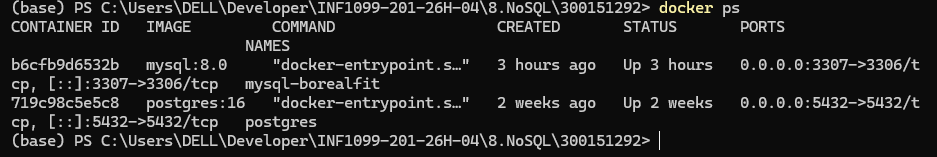
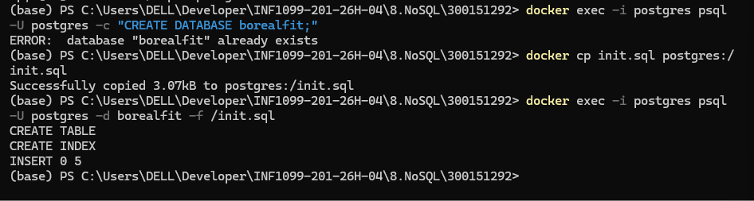
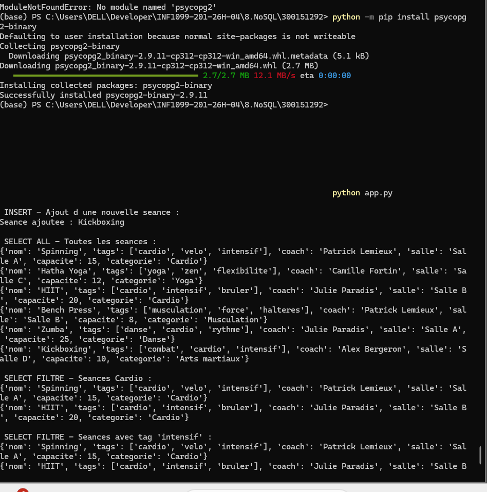
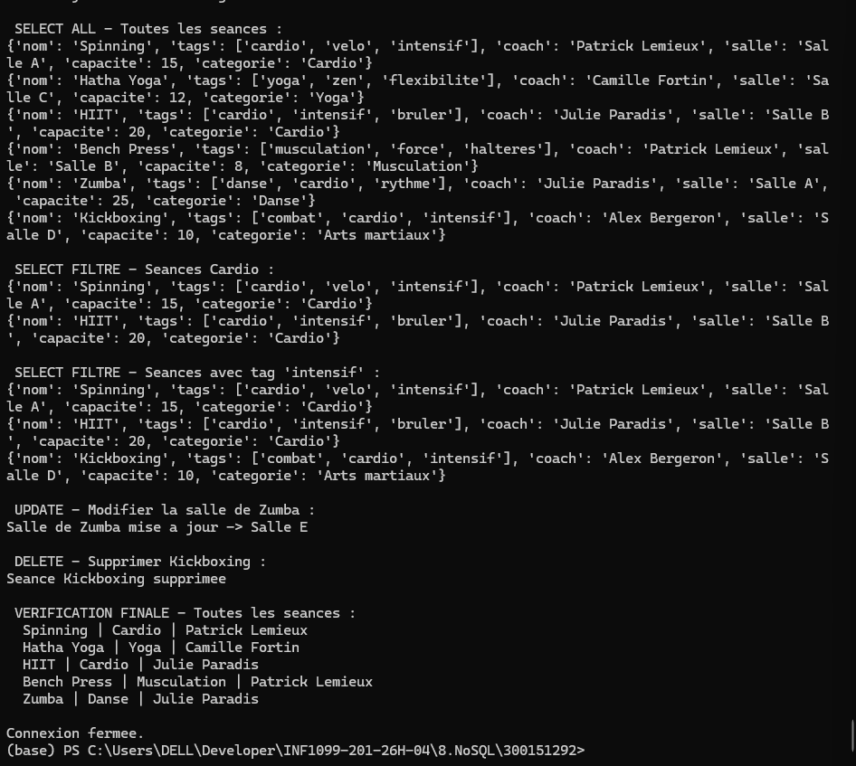

# 🏋️ TP NoSQL — PostgreSQL JSONB
## BorealFit — Mini base NoSQL avec Python et Docker

   

**Auteur : Amine Kahil**  |  **No. étudiant : 300151292**  |  **Domaine : BorealFit**

---

## 📋 Table des matières

- [🎯 Objectif](#-objectif)
- [📁 Structure du projet](#-structure-du-projet)
- [🛠️ Environnement technique](#-environnement-technique)
- [🚀 Étapes réalisées](#-étapes-réalisées)
- [🧪 Requêtes JSONB utilisées](#-requêtes-jsonb-utilisées)
- [🔑 Opérateurs JSONB](#-opérateurs-jsonb)
- [🖼️ Captures d'écran](#-captures-décran)
- [🎓 Compétences acquises](#-compétences-acquises)

---

## 🎯 Objectif

Construire une mini base NoSQL en utilisant PostgreSQL avec le type JSONB, dans un conteneur Docker, et l'interroger via un script Python.

---

## 📁 Structure du projet

```
300151292/
├── images/
│   ├── 1.png      ← Conteneur Docker actif
│   ├── 2.png      ← Données insérées
│   ├── 3.png      ← Vérification psql
│   └── 4.png      ← Script Python
├── init.sql
├── app.py
├── requirements.txt
└── README.md
```

---

## 🛠️ Environnement technique

| Composant | Version |
|-----------|---------|
| 🖥️ OS | Windows 11 |
| 🐳 Conteneur | Docker |
| 🗄️ Base | PostgreSQL 16 |
| 🐍 Langage | Python 3.x |
| 📦 Librairie | psycopg2-binary |

---

## 🚀 Étapes réalisées

### 1️⃣ Lancement du conteneur PostgreSQL

```powershell
docker run --name postgres-nosql `
  -e POSTGRES_USER=postgres `
  -e POSTGRES_PASSWORD=postgres `
  -e POSTGRES_DB=borealfit `
  -p 5433:5432 `
  -d postgres
```

**Vérifier que le conteneur tourne :**
```powershell
docker ps
```



### 2️⃣ Initialisation de la base — init.sql

```powershell
docker cp init.sql postgres-nosql:/init.sql
docker exec -it postgres-nosql psql -U postgres -d borealfit -f /init.sql
```

✅ Création de la table `seances` avec colonne `data JSONB`
✅ Ajout d'un index GIN pour optimiser les requêtes JSONB
✅ Insertion de 5 séances en format JSON

```sql
CREATE TABLE IF NOT EXISTS seances (
    id   SERIAL PRIMARY KEY,
    data JSONB NOT NULL
);

CREATE INDEX idx_seances_data ON seances USING GIN (data);
```



### 3️⃣ Vérification des données

```powershell
docker exec -it postgres-nosql psql -U postgres -d borealfit -c "SELECT data->>'nom' FROM seances;"
```



### 4️⃣ Script Python — app.py

```powershell
pip install -r requirements.txt
python app.py
```

| Opération | Description |
|-----------|-------------|
| ➕ INSERT | Ajout d'une séance en JSON |
| 📋 SELECT ALL | Affichage de toutes les séances |
| 🔎 SELECT filtré | Recherche par catégorie (`->>`) |
| 🔎 SELECT filtré | Recherche par tag (`@>`) |
| ✏️ UPDATE | Modification d'un champ JSON (`\|\|`) |
| 🗑️ DELETE | Suppression d'une séance |



---

## 🧪 Requêtes JSONB utilisées

```sql
-- Recherche par categorie
SELECT data FROM seances
WHERE data->>'categorie' = 'Cardio';

-- Recherche par tag (tableau JSON)
SELECT data FROM seances
WHERE data->'tags' @> '["intensif"]'::jsonb;

-- Mise a jour partielle d un champ JSON
UPDATE seances
SET data = data || '{"salle": "Salle E"}'::jsonb
WHERE data->>'nom' = 'Zumba';

-- Suppression d une seance
DELETE FROM seances
WHERE data->>'nom' = 'Kickboxing';
```

---

## 🔑 Opérateurs JSONB

| Opérateur | Description |
|-----------|-------------|
| `->` | Accès à un champ JSON (retourne du JSON) |
| `->>` | Accès à un champ JSON (retourne du texte) |
| `@>` | Vérifie si un tableau JSON contient une valeur |
| `\|\|` | Fusionne deux objets JSON (utilisé pour UPDATE) |

---

## 🖼️ Captures d'écran

| # | Capture | Description |
|---|---------|-------------|
| 1 |  | Conteneur Docker actif |
| 2 |  | Données JSON insérées |
| 3 |  | Vérification psql |
| 4 |  | Script Python exécuté |

---

## 🎓 Compétences acquises

- 🗄️ Utilisation de JSONB dans PostgreSQL comme stockage NoSQL
- 🐳 Gestion de conteneurs avec Docker
- 🔍 Opérateurs JSONB : `->`, `->>`, `@>`, `||`
- 🐍 Interaction Python avec PostgreSQL via psycopg2
- 📦 Gestion des dépendances avec `requirements.txt`

---

## ✅ Résultat final

| Élément | Statut |
|---------|--------|
| Conteneur PostgreSQL lancé | ✅ |
| Table seances créée | ✅ |
| Index GIN présent | ✅ |
| Données JSON insérées | ✅ |
| Script Python fonctionnel | ✅ |
| INSERT / SELECT / UPDATE / DELETE | ✅ |

---

*TP NoSQL — PostgreSQL JSONB · Amine Kahil · 300151292*
