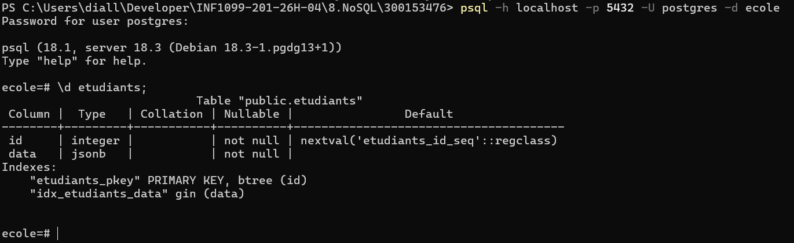
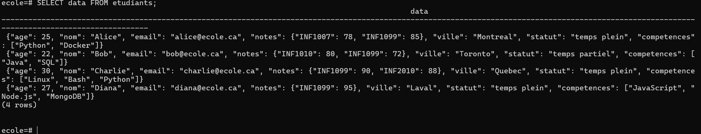
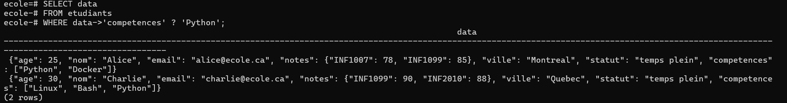
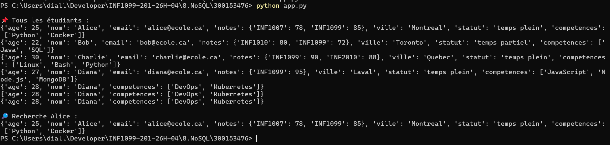

# 🧪 TP NoSQL — PostgreSQL JSONB avec Docker et Python

**Cours :** INF1099 — Bases de données  
**Étudiant·e :** Ramatoulaye Diallo  
**Matricule :** 300153476

---

# 🎯 Objectif

Construire une mini base NoSQL avec :

* PostgreSQL (JSONB)
* Docker / Podman (conteneur)
* Python + `requirements.txt` pour les dépendances

---

# 🧱 1️⃣ Lancer PostgreSQL avec Docker

```powershell id="d6kq7x"
podman run -d `
  -e POSTGRES_USER=postgres `
  -e POSTGRES_PASSWORD=postgres `
  -e POSTGRES_DB=ecole `
  -p 5432:5432 `
  -v $PWD/init.sql:/docker-entrypoint-initdb.d/init.sql `
  --name postgres-nosql `
  postgres
```

---

# 📄 2️⃣ Fichier SQL : `init.sql`

👉 Crée la table + charge les données automatiquement au démarrage

```sql id="g8m2pq"
CREATE TABLE etudiants (
    id SERIAL PRIMARY KEY,
    data JSONB NOT NULL
);

CREATE INDEX idx_etudiants_data
ON etudiants USING GIN (data);

INSERT INTO etudiants (data) VALUES
('{"nom": "Alice", "age": 25, "email": "alice@ecole.ca", "ville": "Montreal", "statut": "temps plein", "competences": ["Python", "Docker"], "notes": {"INF1007": 78, "INF1099": 85}}'),
('{"nom": "Bob", "age": 22, "email": "bob@ecole.ca", "ville": "Toronto", "statut": "temps partiel", "competences": ["Java", "SQL"], "notes": {"INF1010": 80, "INF1099": 72}}'),
('{"nom": "Charlie", "age": 30, "email": "charlie@ecole.ca", "ville": "Quebec", "statut": "temps plein", "competences": ["Linux", "Bash", "Python"], "notes": {"INF1099": 90, "INF2010": 88}}'),
('{"nom": "Diana", "age": 27, "email": "diana@ecole.ca", "ville": "Laval", "statut": "temps plein", "competences": ["JavaScript", "Node.js", "MongoDB"], "notes": {"INF1099": 95}}');
```

---

# 📦 3️⃣ Dépendances Python

## 📄 `requirements.txt`

```txt id="k1n7rt"
psycopg2-binary
```

---

## 📥 Installation

```powershell id="p9x2lm"
pip install -r requirements.txt
```

📸 **Preuve — Installation des dépendances :**


---

# ✅ 4️⃣ Vérifications PostgreSQL (`psql`)

## Connexion à la base

```powershell id="c3x8mv"
psql -h localhost -p 5432 -U postgres -d ecole
```

## Structure de la table

```sql id="s1a4zr"
\d etudiants;
```

📸 **Preuve — Création table + insertions :**



---

## Vérification des données

```sql id="v7b2kn"
SELECT data FROM etudiants;
```

📸 **Preuve — Contenu de la table étudiants :**



---

## 🔍 Requêtes JSONB avancées

### Recherche par nom (opérateur `->>`)

```sql id="n5q1yw"
SELECT data
FROM etudiants
WHERE data->>'nom' = 'Alice';
```

📸 **Preuve — Recherche par nom :**


---

### Recherche par compétence (opérateur `?`)

```sql id="r9m3lp"
SELECT data
FROM etudiants
WHERE data->'competences' ? 'Python';
```

📸 **Preuve — Recherche par compétence :**



---

# 🐍 5️⃣ Script Python : `app.py`

```python id="t3v9qa"
import psycopg2
import json

conn = psycopg2.connect(
    dbname="ecole",
    user="postgres",
    password="postgres",
    host="localhost",
    port=5432
)
cur = conn.cursor()

# 🔹 INSERT JSON dynamique
nouvel_etudiant = {
    "nom": "Diana",
    "age": 28,
    "competences": ["DevOps", "Kubernetes"]
}
cur.execute(
    "INSERT INTO etudiants (data) VALUES (%s)",
    [json.dumps(nouvel_etudiant)]
)
conn.commit()

# 🔹 SELECT ALL
print("\n📌 Tous les étudiants :")
cur.execute("SELECT data FROM etudiants")
for row in cur.fetchall():
    print(row[0])

# 🔹 SEARCH par nom
print("\n🔎 Recherche Alice :")
cur.execute("""
    SELECT data FROM etudiants
    WHERE data->>'nom' = 'Alice'
""")
for row in cur.fetchall():
    print(row[0])

cur.close()
conn.close()
```

---

## ▶️ Exécution

```powershell id="e2w6ht"
python app.py
```

📸 **Preuve — Exécution du script Python :**



---

# 📦 LIVRABLES

```text id="y5kq1v"
300153476/
├── README.md
├── images/
│   ├── installation_requirement.png
│   ├── Creation_table_insertion.png
│   ├── verification_de_table_etudiant.png
│   ├── recherche_par_nom.png
│   ├── recherche_par_competance.png
│   └── python_execution.png
├── init.sql
├── app.py
└── requirements.txt
```

---

# 🎓 COMPÉTENCES ACQUISES

* Déploiement de PostgreSQL avec Docker/Podman
* Modélisation hybride SQL/NoSQL avec le type `JSONB`
* Indexation `GIN` pour l'optimisation des requêtes
* Manipulation de données semi-structurées avec Python
* Utilisation correcte des opérateurs `->`, `->>` et `?`
